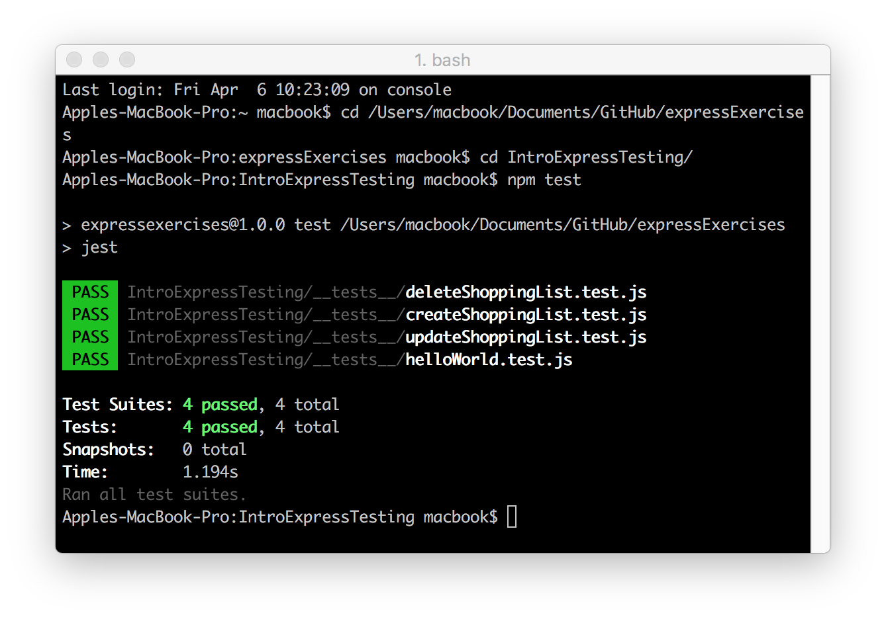

## Intro to Express + Testing
___demonstrates how to create Express routes and then test them.___

We'll be sending requests to it and viewing responses with Postman. When a user visits `/`:
```js
app.get('/', (req, res) => res.send('Hello World!'))
```
`/` is our route. 

`(req, res) => res.send('Hello World!')` is our controller (or route handler) - it decides what happens when we visit a route. When we visit `/`, `app.get` calls our route controller function and passes in information about the request we made to the `req` parameter, and gives us some methods to respond to the request on the `res` parameter - in this case `.send()`.

When we look to retrieve data from a server, we make a GET route. However, if we send data to the server with the intention of storing it on the server - then we make a POST route. 

When we send data to a server with the intention of modifying some existing data (think editing your social media profile), then we make a PUT request.

When you make a request to a server with the intention of removing some data from that server then you make a DELETE request.



### Initial reading:
- [MDN: Express/Node Introduction](https://developer.mozilla.org/en-US/docs/Learn/Server-side/Express_Nodejs/Introduction)
